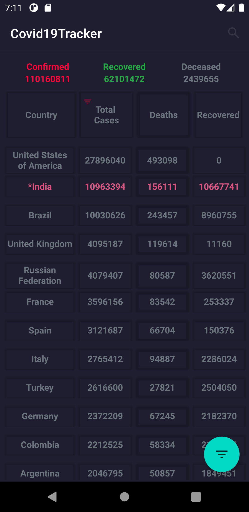
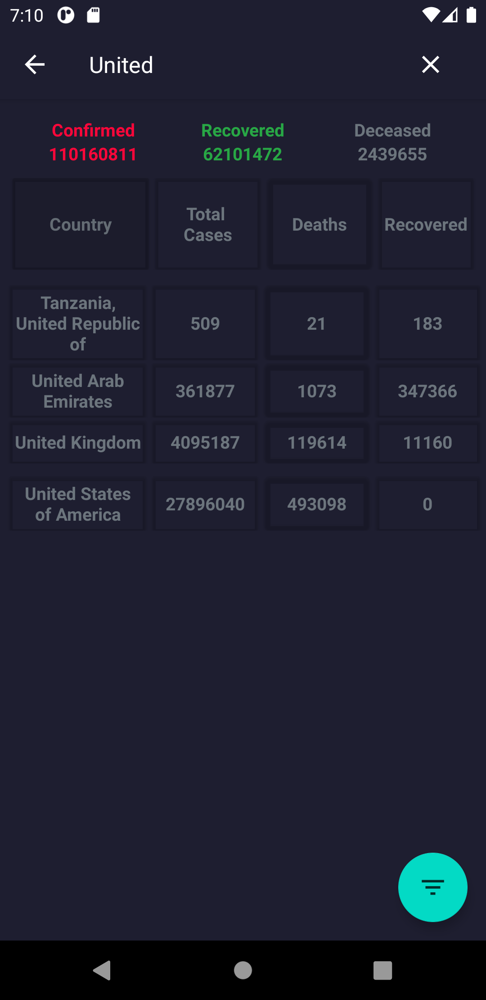
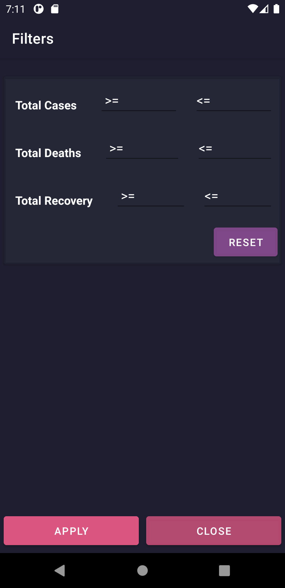

# Covid19Tracker Android Application
  Covid19Tracker is an Android application which shows worldwide data of confirmed cases, recovered cases and death cases.It displays the latest updates based on numbers from https://api.covid19api.com/summary
  
## Application Interface
         

## Required Permissions
    android.permission.INTERNET
    android.permission.ACCESS_FINE_LOCATION

# Libraries
- Gson
- Retrofit2
